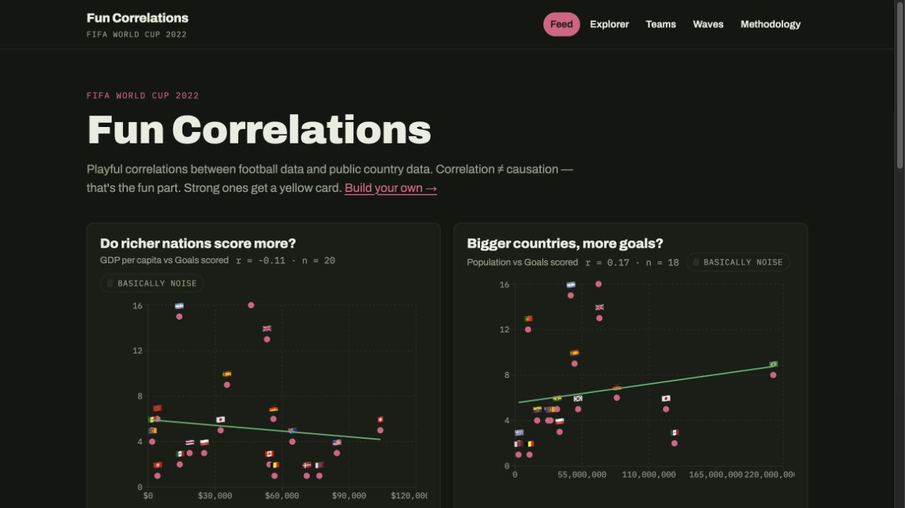
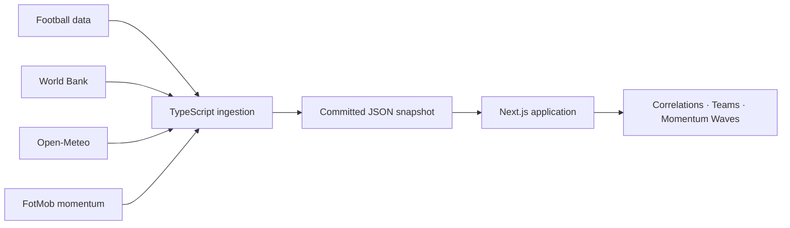

# World Cup Fun Correlations

An interactive data story that puts FIFA World Cup performance beside the
economic, geographic, and weather data of the nations competing.

[](https://nextjs.org/)
[](https://react.dev/)
[](https://www.typescriptlang.org/)
[](https://vitest.dev/)



## The idea

Do richer nations score more? Does heat affect possession? Are more populous
countries better at finding the net?

This project turns those questions into explorable scatter plots, calculates
real Pearson correlation coefficients, and translates the result into a
plain-language verdict. A second visualization, **Momentum Waves**, renders
iconic matches as two team-colored tides whose moving front follows the shape
of the game and whose goals land as ripples.

> Correlation is not causation. The analysis is intentionally playful,
> descriptive, and based on a small tournament sample.

## Highlights

- **Curated correlation feed** with approachable headlines and statistical
  context
- **Build-your-own explorer** for pairing football and country variables
- **Sortable team profiles** backed by a committed, reproducible snapshot
- **WebGL2 match visualizations** with playback controls and an accessible
  static fallback
- **Shareable URLs** that preserve explorer selections
- **Static-first architecture** with no database, backend, or browser-exposed
  API keys
- **Automated test suite** covering the data pipeline, statistics, routing,
  components, and momentum rendering math

## How it works



The browser reads only versioned JSON in `public/data`. External APIs are
called by local ingestion scripts, keeping credentials and rate limits out of
the application runtime.

The committed snapshot covers **FIFA World Cup 2022 in Qatar**, the latest
complete tournament available to the original free data plan. The pipeline is
season-parameterized through `WC_SEASON`, so it can move to 2026 when a
compatible data source or plan is available.

## Tech stack

| Layer | Technology |
| --- | --- |
| Application | Next.js 15, React 19, TypeScript |
| Charts | Recharts |
| Match art | WebGL2, GLSL shaders, Canvas fallback |
| Data pipeline | TypeScript, `tsx`, static JSON snapshots |
| Testing | Vitest, Testing Library, jsdom |
| Data | API-Football, World Bank, Open-Meteo, FotMob |

## Run locally

```bash
git clone https://github.com/gabriel-rene/world-cup-26.git
cd world-cup-26
npm install
npm run dev
```

Open [http://localhost:3000](http://localhost:3000).

```bash
npm test       # run the test suite
npm run build  # create a production build
```

The committed snapshot is enough to run the full application. No API key is
required unless you want to rebuild the source data.

## Rebuild the data

Create a local `.env` file:

```dotenv
API_FOOTBALL_KEY=your_key_here
```

Then run the ingestion steps:

```bash
npm run ingest:football
npm run ingest:worldbank
npm run ingest:weather
npm run build:snapshot
```

Momentum snapshots are configured separately in
`ingestion/waves-config.ts` and generated with:

```bash
npm run ingest:waves
```

Raw responses are cached under the git-ignored `data/raw/` directory. The
football ingestion process throttles requests and resumes from the cache after
an interruption.

## Data sources

| Source | Used for |
| --- | --- |
| [API-Football](https://www.api-football.com/) | Teams, fixtures, and per-match statistics |
| [World Bank](https://data.worldbank.org/) | Population, GDP, GDP per capita, and land area |
| [Open-Meteo](https://open-meteo.com/) | Venue weather at kickoff |
| [FotMob](https://www.fotmob.com/) | Per-minute momentum for selected matches |
| [Fjelstul World Cup Database](https://github.com/jfjelstul/worldcup) | Historical tournaments for future expansion |

## Project structure

```text
src/app/          Routes and page composition
src/components/   Charts, controls, tables, and WebGL views
src/lib/          Correlation, snapshot, URL, and wave-domain logic
ingestion/        Reproducible data collection and snapshot builders
public/data/      Versioned application data
```

Design decisions and implementation notes live in
[`docs/superpowers`](docs/superpowers).
